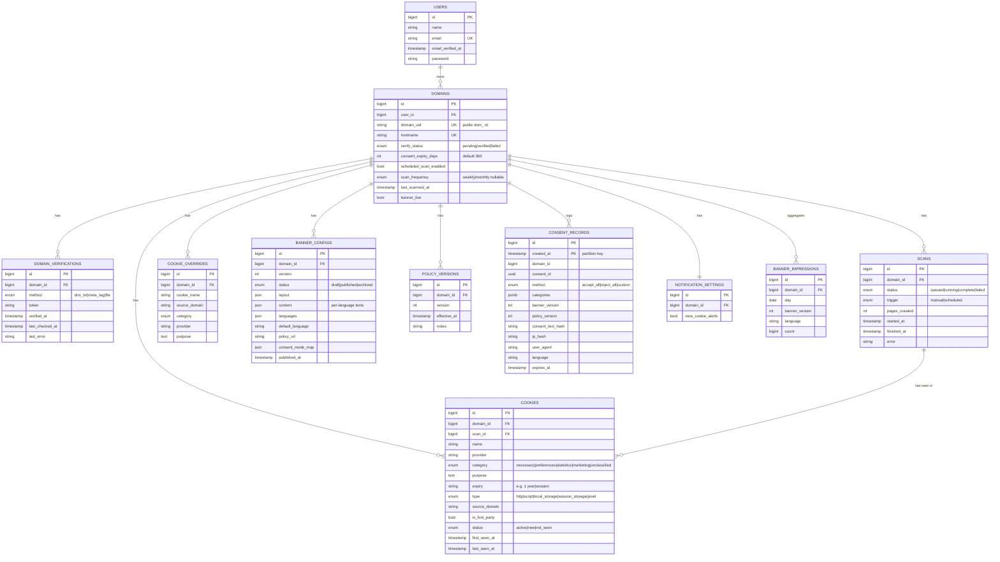

# Data Model — ERD & Migration Sketch

**Version:** 0.1
**Date:** 2026-05-27
**Companion:** [technical-spec.md](technical-spec.md) §5, [functional-spec.md](functional-spec.md) §6

Postgres in prod (SQLite local). `consent_records` is append-only and
month-partitioned. `users` already exists (Laravel/Fortify) — extended, not
recreated.

---

## 1. ERD



---

## 2. Migration Sketches (Laravel Schema)

Ordering respects FKs: users → domains → children → consent_records (raw SQL).

### 2.1 `domains`
```php
Schema::create('domains', function (Blueprint $table) {
    $table->id();
    $table->foreignId('user_id')->constrained()->cascadeOnDelete();
    $table->string('domain_uid')->unique();        // public "dom_..." id
    $table->string('hostname')->unique();
    $table->enum('verify_status', ['pending', 'verified', 'failed'])->default('pending');
    $table->unsignedSmallInteger('consent_expiry_days')->default(365);
    $table->boolean('scheduled_scan_enabled')->default(false);
    $table->enum('scan_frequency', ['weekly', 'monthly'])->nullable();
    $table->timestamp('last_scanned_at')->nullable();
    $table->boolean('banner_live')->default(false);
    $table->timestamps();
});
```

### 2.2 `domain_verifications`
```php
Schema::create('domain_verifications', function (Blueprint $table) {
    $table->id();
    $table->foreignId('domain_id')->constrained()->cascadeOnDelete();
    $table->enum('method', ['dns_txt', 'meta_tag', 'file']);
    $table->string('token');
    $table->timestamp('verified_at')->nullable();
    $table->timestamp('last_checked_at')->nullable();
    $table->string('last_error')->nullable();
    $table->timestamps();
    $table->index(['domain_id', 'method']);
});
```

### 2.3 `scans`
```php
Schema::create('scans', function (Blueprint $table) {
    $table->id();
    $table->foreignId('domain_id')->constrained()->cascadeOnDelete();
    $table->enum('status', ['queued', 'running', 'complete', 'failed'])->default('queued');
    $table->enum('trigger', ['manual', 'scheduled'])->default('manual');
    $table->unsignedInteger('pages_crawled')->default(0);
    $table->timestamp('started_at')->nullable();
    $table->timestamp('finished_at')->nullable();
    $table->string('error')->nullable();
    $table->timestamps();
    $table->index(['domain_id', 'created_at']);
});
```

### 2.4 `cookies`
```php
Schema::create('cookies', function (Blueprint $table) {
    $table->id();
    $table->foreignId('domain_id')->constrained()->cascadeOnDelete();
    $table->foreignId('scan_id')->nullable()->constrained()->nullOnDelete();
    $table->string('name');
    $table->string('provider')->nullable();
    $table->enum('category', ['necessary', 'preferences', 'statistics', 'marketing', 'unclassified'])
          ->default('unclassified');
    $table->text('purpose')->nullable();
    $table->string('expiry')->nullable();           // "1 year" | "session"
    $table->enum('type', ['http', 'script', 'local_storage', 'session_storage', 'pixel']);
    $table->string('source_domain')->nullable();
    $table->boolean('is_first_party')->default(true);
    $table->enum('status', ['active', 'new', 'not_seen'])->default('new');
    $table->timestamp('first_seen_at')->nullable();
    $table->timestamp('last_seen_at')->nullable();
    $table->timestamps();
    $table->unique(['domain_id', 'name', 'source_domain']);
});
```

### 2.5 `cookie_overrides`
Manual classification that survives re-scans (US-SCAN-3). Keyed by cookie identity,
not by `cookies.id`, so it re-applies when a cookie row is regenerated.
```php
Schema::create('cookie_overrides', function (Blueprint $table) {
    $table->id();
    $table->foreignId('domain_id')->constrained()->cascadeOnDelete();
    $table->string('cookie_name');
    $table->string('source_domain')->nullable();
    $table->enum('category', ['necessary', 'preferences', 'statistics', 'marketing']);
    $table->string('provider')->nullable();
    $table->text('purpose')->nullable();
    $table->timestamps();
    $table->unique(['domain_id', 'cookie_name', 'source_domain']);
});
```

### 2.6 `banner_configs`
```php
Schema::create('banner_configs', function (Blueprint $table) {
    $table->id();
    $table->foreignId('domain_id')->constrained()->cascadeOnDelete();
    $table->unsignedInteger('version');
    $table->enum('status', ['draft', 'published', 'archived'])->default('draft');
    $table->json('layout');                 // type, position, theme, colors, logo
    $table->json('content');                // per-language texts + button labels
    $table->json('languages');              // ["en","pt","de"]
    $table->string('default_language')->default('en');
    $table->string('policy_url')->nullable();
    $table->json('consent_mode_map')->nullable();
    $table->timestamp('published_at')->nullable();
    $table->timestamps();
    $table->unique(['domain_id', 'version']);
});
// One published config per domain — enforced in app + partial unique index (Postgres):
// CREATE UNIQUE INDEX one_published_per_domain ON banner_configs (domain_id)
//   WHERE status = 'published';
```

### 2.7 `policy_versions`
```php
Schema::create('policy_versions', function (Blueprint $table) {
    $table->id();
    $table->foreignId('domain_id')->constrained()->cascadeOnDelete();
    $table->unsignedInteger('version');
    $table->timestamp('effective_at');
    $table->string('notes')->nullable();
    $table->timestamps();
    $table->unique(['domain_id', 'version']);
});
```

### 2.8 `notification_settings`
```php
Schema::create('notification_settings', function (Blueprint $table) {
    $table->id();
    $table->foreignId('domain_id')->constrained()->cascadeOnDelete();
    $table->boolean('new_cookie_alerts')->default(true);
    $table->timestamps();
    $table->unique('domain_id');
});
```

### 2.9 `banner_impressions` (daily aggregate)
Row-per-impression too costly; aggregate by day/version/language. Beacon upserts
`count` (US-DASH-1).
```php
Schema::create('banner_impressions', function (Blueprint $table) {
    $table->id();
    $table->foreignId('domain_id')->constrained()->cascadeOnDelete();
    $table->date('day');
    $table->unsignedInteger('banner_version');
    $table->string('language', 12);
    $table->unsignedBigInteger('count')->default(0);
    $table->timestamps();
    $table->unique(['domain_id', 'day', 'banner_version', 'language']);
});
```

### 2.10 `consent_records` (append-only, month-partitioned)
Laravel Schema can't express native partitioning — use raw SQL in the migration.
Partition key must be part of the PK, so PK = `(id, created_at)`.

```php
public function up(): void
{
    // Postgres (prod). For SQLite local dev, fall back to a plain table.
    if (DB::getDriverName() === 'pgsql') {
        DB::statement(<<<'SQL'
            CREATE TABLE consent_records (
                id                BIGINT GENERATED ALWAYS AS IDENTITY,
                created_at        TIMESTAMPTZ NOT NULL,
                domain_id         BIGINT NOT NULL,
                consent_id        UUID NOT NULL,
                method            TEXT NOT NULL CHECK (method IN ('accept_all','reject_all','custom')),
                categories        JSONB NOT NULL,
                banner_version    INTEGER NOT NULL,
                policy_version    INTEGER NOT NULL,
                consent_text_hash TEXT NOT NULL,
                ip_hash           TEXT,
                user_agent        TEXT,
                language          TEXT,
                expires_at        TIMESTAMPTZ,
                PRIMARY KEY (id, created_at)
            ) PARTITION BY RANGE (created_at);
        SQL);

        DB::statement('CREATE INDEX idx_consent_domain_created ON consent_records (domain_id, created_at)');
        DB::statement('CREATE INDEX idx_consent_consent_id ON consent_records (consent_id)');
        // Monthly partitions created ahead of time by a scheduled job (see §3).
    } else {
        Schema::create('consent_records', function (Blueprint $table) {
            $table->id();
            $table->timestamp('created_at');
            $table->foreignId('domain_id')->constrained()->cascadeOnDelete();
            $table->uuid('consent_id');
            $table->enum('method', ['accept_all', 'reject_all', 'custom']);
            $table->json('categories');
            $table->unsignedInteger('banner_version');
            $table->unsignedInteger('policy_version');
            $table->string('consent_text_hash');
            $table->string('ip_hash')->nullable();
            $table->string('user_agent')->nullable();
            $table->string('language')->nullable();
            $table->timestamp('expires_at')->nullable();
            $table->index(['domain_id', 'created_at']);
        });
    }
}
```

> No `updated_at` — records are immutable (spec §4.6). No FK on `domain_id` in the
> partitioned table (write-path perf + retention via partition drop); integrity
> enforced in app.

---

## 3. Partition & Retention Lifecycle

- **Create ahead:** a scheduled job pre-creates next month's partition, e.g.
  `consent_records_2026_06` for `['2026-06-01','2026-07-01')`.
- **Purge:** `PurgeExpiredConsentJob` (daily) runs
  `DROP TABLE consent_records_<YYYY_MM>` for partitions wholly older than 24 months
  — O(1) vs row-by-row delete (spec §5.4).
- **Domain delete:** does NOT delete consent logs early; they age out by partition
  (US-LOG-4 / US-SET-4).

---

## 4. Notes & Open Items

- `users` table unchanged at launch; team/multi-user (v2) will add a pivot
  (`domain_user` with role) — out of scope now.
- Free-tier 1-domain cap enforced in app (Domain create policy), not schema.
- `cookies.status` (`new`/`not_seen`) drives change detection (US-SCAN-4); set by
  the scan-diff step.
- Consider GIN index on `consent_records.categories` only if category-level queries
  prove slow — defer until measured.
- `ip_hash` = salted hash; salt stored in Key Vault, rotated with care (rotation
  breaks correlation by design — acceptable).
